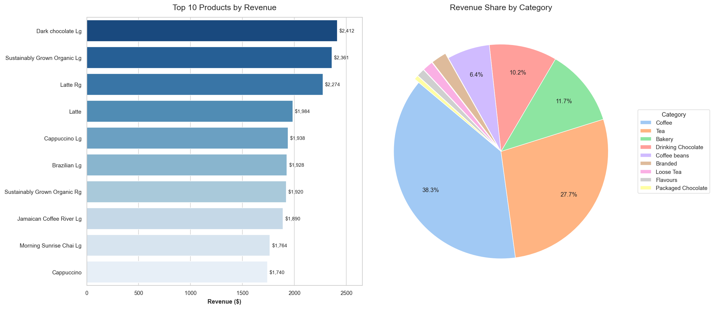
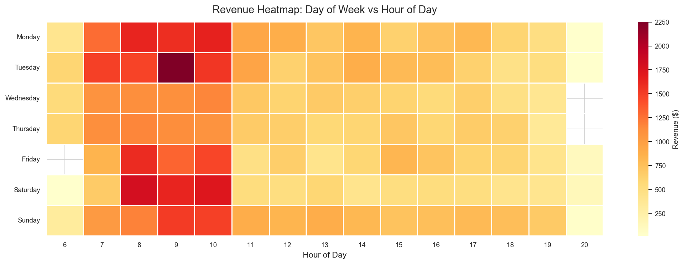
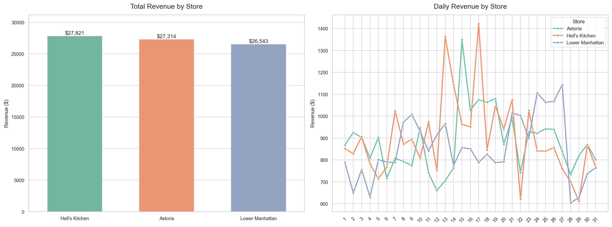

# ☕ Cafe Sales Data Analysis

## Overview
Analysis of cafe transaction data to uncover sales patterns 
across time, products, and store locations.

## Key Findings
- Peak sales hours: 8-10 A.M.
- Best performing store: Hell's Kitchen
- Top revenue product: Dark chocolate Lg

## Tools & Libraries
- Python 3.x
- Pandas
- Matplotlib
- Seaborn

## Visualizations

